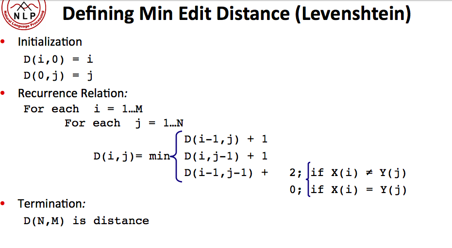

# Edit Distance

## Description

Given two words _word1_ and _word2_, find the minimum number of operations required to convert _word1_ to _word2_.

You have the following 3 operations permitted on a word:

1. Insert a character
2. Delete a character
3. Replace a character

## Example

**Example 1:**

```text
Input: word1 = "horse", word2 = "ros"
Output: 3
Explanation: 
horse -> rorse (replace 'h' with 'r')
rorse -> rose (remove 'r')
rose -> ros (remove 'e')
```

**Example 2:**

```text
Input: word1 = "intention", word2 = "execution"
Output: 5
Explanation: 
intention -> inention (remove 't')
inention -> enention (replace 'i' with 'e')
enention -> exention (replace 'n' with 'x')
exention -> exection (replace 'n' with 'c')
exection -> execution (insert 'u')
```

## Solution

很久远的一道题了。。一直搁置着没有做。。

妈勒个鸡，怎么又是DP。。

坑爹了，，不会做。。

分析：word1 是start state，  word2是final state，每次的操作包含delete, insert, replace三种分支操作，我们要做的就是找到从start state的final state的最短路径。当然，这个搜索空间是比较巨大的，所以我们很自然的想到记录一下重复出现的中间结果，于是乎，DP登场了。



```java
class Solution {
    public int minDistance(String word1, String word2) {
        int n = word1.length();
        int m = word2.length();
        int[][] dp = new int[n + 1][m + 1];
        for (int i = 1; i <= n; i++) {
            dp[i][0] = i;
        }
        for (int j = 1; j <= m; j++) {
            dp[0][j] = j;
        }
        for (int i = 1; i <= n; i++) {
            for (int j = 1; j <= m; j++) {
                int min = Math.min(dp[i - 1][j], dp[i][j - 1]) + 1;
                if (word1.charAt(i - 1) == word2.charAt(j - 1)) {
                    min = Math.min(min, dp[i - 1][j - 1]);
                } else {
                    min = Math.min(min, dp[i - 1][j - 1] + 1);
                }
                dp[i][j] = min;
            }
        }
        return dp[n][m];
    }
}
```

follow up1: 如果每个操作是有权重的，那么只要需要把+1的部分修改成对应的权重就可以了。

follow up2: 如果需要知道alignment或者就是我们具体作出的最优的选择，那么只需要用一个额外的二维数组来做backtrace就可以了。

