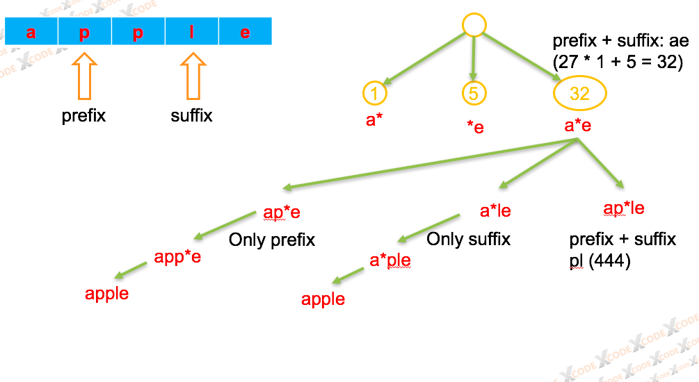

# Prefix and Suffix Search

## Description

Given many `words`, `words[i]` has weight `i`.

Design a class `WordFilter` that supports one function, `WordFilter.f(String prefix, String suffix)`. It will return the word with given `prefix` and `suffix` with maximum weight. If no word exists, return -1.

**Examples:**

```text
Input:
WordFilter(["apple"])
WordFilter.f("a", "e") // returns 0
WordFilter.f("b", "") // returns -1
```

**Note:**

1. `words` has length in range `[1, 15000]`.
2. For each test case, up to `words.length` queries `WordFilter.f` may be made.
3. `words[i]` has length in range `[1, 10]`.
4. `prefix, suffix` have lengths in range `[0, 10]`.
5. `words[i]` and `prefix, suffix` queries consist of lowercase letters only.

## Solution

这道题Brute Force的方法就是用两个Trie，然后求Set的交集，它复杂度为：

* Time Complexity: O\(NK + Q\(N+K\)\)O\(NK+Q\(N+K\)\) where NN is the number of words, KK is the maximum length of a word, and QQ is the number of queries. If we use memoization in our solution, we could produce tighter bounds for this complexity, as the complex queries are somewhat disjoint.
* Space Complexity: O\(NK\)O\(NK\), the size of the tries.

想要进一步优化时间复杂度的话，我们需要同时存储prefix和suffix，并且利用了一种类似27进制的编码来区分单纯prefix, suffix或者两者都有的情况。



  
复杂度分析：

* Time Complexity: O\(NK^2 + QK\)O\(NK2+QK\) where NN is the number of words, KK is the maximum length of a word, and QQ is the number of queries.
* Space Complexity: O\(NK^2\)O\(NK2\), the size of the trie.

代码如下：

```java
class WordFilter {
    Trie tree;

    private class TrieNode {
        int weight;
        Map<Integer, TrieNode> children;
        public TrieNode() {
            children = new HashMap<>();
        }
    }
    
    private class Trie {
        TrieNode root;
        
        public Trie() {
            this.root = new TrieNode();
        }
        
        public void insertPrefix(String word, int weight, int start, TrieNode node) {
            TrieNode cur = node;
            for (int i = start; i < word.length(); i++) {
                cur = cur.children.computeIfAbsent(hashcode(word.charAt(i), '`'), k -> new TrieNode());
                cur.weight = weight;
            }
        }
        
        public void insertSuffix(String word, int weight, int start, TrieNode node) {
            TrieNode cur = node;
            for (int i = start; i >= 0; i--) {
                cur = cur.children.computeIfAbsent(hashcode('`', word.charAt(i)), k -> new TrieNode());
                cur.weight = weight;
            }
        }
        
        public TrieNode addNode(char prefix, char suffix, int weight, TrieNode node) {
             TrieNode cur = node;
            cur = cur.children.computeIfAbsent(hashcode(prefix, suffix), k -> new TrieNode());
            cur.weight = weight;
            return cur;
        }
    }
    
    public WordFilter(String[] words) {
        this.tree = new Trie();
        for (int i = 0; i < words.length; i++) {
            String word = words[i];
            TrieNode root = tree.root;
            int len = word.length();
            for (int j = 0; j < len; j++) {
                tree.insertPrefix(word, i, j, root);
                tree.insertSuffix(word, i, len - 1 - j, root);
                root = tree.addNode(word.charAt(j), word.charAt(len - 1 - j), i, root);
            }
        }
    }
    
    public int f(String prefix, String suffix) {
        TrieNode root = this.tree.root;
        for (int i = 0, j = suffix.length() - 1; i < prefix.length() || j >= 0; i++, j--) {
            char prefixchar = i < prefix.length() ? prefix.charAt(i) : '`';
            char suffixchar = j >= 0 ? suffix.charAt(j) : '`';
            root = root.children.get(hashcode(prefixchar, suffixchar));
            if (root == null) {
                return -1;
            }
        }
        return root.weight;
    }
    
    public int hashcode(char prefix, char suffix) {
        return (prefix - '`') * 27 + (suffix - '`');
    }
}

/**
 * Your WordFilter object will be instantiated and called as such:
 * WordFilter obj = new WordFilter(words);
 * int param_1 = obj.f(prefix,suffix);
 */
```

